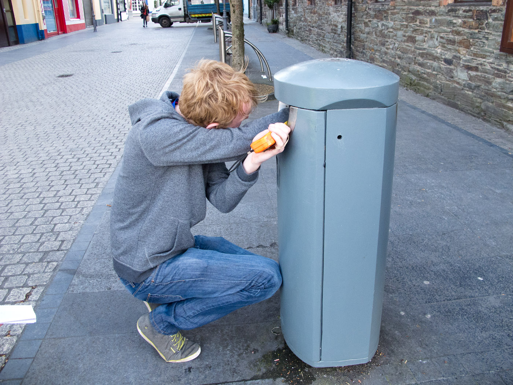

## Digistreets: Trash Talk

### Synopsis
The idea for this project is to **create talking litter bins** during Imagine Festival.

Urban rubbish bins are utilitarian devices. While the design of urban bins may continue to evolve, their function always remains the same. They are in situ to aid in keeping our streets clean and rely on the voluntary participation of humans to work effectively. Can we re-imaging a new design that might increase this voluntary participation? 
What would happen if we create bins that aims to amuse, bewilder or entertain?

SEMS plan to augment a random selection of bins in the city centre to interact with their users. These altered bins will begin talking when triggered by either the the act of throwing rubbish away or the proximity of a person nearby. How will people respond to these bins?  Will the playfulness of these interactions encourage people to pick up and bin waste that isn't their own ? Ultimately, could the entertainment value of interactive bins result in cleaner streets?

The proposed location is Barron Strand Street/Michael Street. Each talking bin will be fitted with a small battery operated device, using an Arduino and an mp3 shield that can play sound files repeatedly, randomly or in a specific order. PIR sensors will be used to trigger the sound files.The plan is to only have talking bins operational in the day time only.

Different bins could be triggered in different ways, 
either by
- responding to users day to day normal interaction of users (i.e. throwing rubbish away) or
- by sensing a user approaching.

We have discussed this project with Conor Nolan and Brid Kirby of Waterford City and County Council although more formalized arrangements need to be made now.
This includes:

- Gaining access to a bin or keys to a bin for prototyping. This will make it easier for us to test the functionality of prototypes we are making and assess /address installation options. This may vary with different bin types. 
- Arrange regular emptying of bins during Digistreets to avoid any overflow issues that may result.
- If its possible to work with the Council to put a plan in place to measure the volume of waste collected during the  interactive bins installation. 

### Nature of Interaction

What sound files will they play? How can these bins collectively make sense? 

### Sound Ideas
(following meeting with Ollie Breslin on 13th April, 2016)

There is a possibility SEMS could work with the young people of Waterford Youth Arts (WYA) to develop the sounds for these bins.
[[http://www.waterfordyoutharts.com/]]
WYA's have their own recording studio on site to record the sounds. If this is the route we decide to go SEMS should demo the prototype and introduce the members of Waterford Youth Arts to Arduino and interactivity. Once the kids have an understanding of how the technology works they can begin to develop ideas for the sound element of this project.  One possible route to idea development would be to have a drama improvisation workshop at WYA but all of this will be planned with Ollie Breslin in the near future once a prototype is finished. (i.e May 2016)

### Sound Ideas (please add your own)

1. Each bin could appear to have its own individual personalities.
For example:
* One bin could positive uplifting word like "You're beautiful" or "you're lovely"
* Another bin could be a constant complainer muttering in a despondent voice "same old, same old" or "here we go again"
* Maybe another bin is just plain rude. 
* Maybe another just speaks Polish.

2. Maybe the bins could tell a story with snippets revealed at different bins or a recollection of citizen's memories associated with a time or place( e.g. Barronstrand / Michael street is the proposed pedestrian location for the bins)

3. Maybe the bins could utter simple phrases like 'Feed me' or 'Thank you' 

